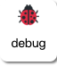
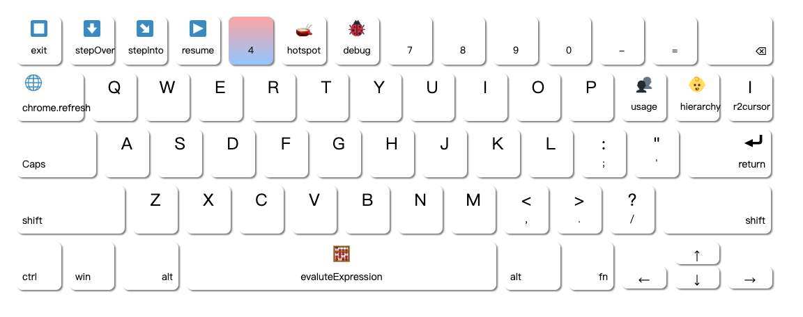

# Keyboard Template

>
> Render & output keyboard for keymap designer
>
> supports 60 keystrokes | Winodws | MacOS
>
>   

## Install & Run

```bash
git clone https://github.com/miozus/keyboardTemplate
```

```bash
npm install
npm run dev
```

```bash
# open chrome
http://localhost:3000/
```

## Usage

```bash
❯ tree -L 4 -I 'node_modules'
.
├── README.md
├── index.html
├── package.json
├── postcss.config.js
├── public
├── src
│   ├── App.vue
│   ├── assets
│   │   ├── css              <- 3️⃣ global keystroke css style (optional)
│   │   │   ├── keyboard.css
│   │   │   └── tailwind.css 
│   │   └── fonts
│   ├── components
│   │   ├── Keyboard.vue     <- 4️⃣ render and download controller (optional)
│   │   ├── Nav.vue          <- 1️⃣ import keyboard json (copy data/normal.json then change)
│   │   └── Tabs.vue
│   ├── data                 <- 2️⃣ custom keyboard as json 
│   │   ├── normal.json
│   │   ├── portia.json
│   │   └── semicolon.json
│   └── main.js
├── tailwind.config.js      
└── vite.config.js
```

1️⃣ import

```javascript
import debug from "../data/debug.json";

//...

export default defineComponent({
  data() {
    return {
      categories,   
      keymap: debug,    // your keyboard name
    };
  },
});

```

2️⃣ custom

An example of one keystroke in  `/data/debug.json`

```json
{
   "id":7,          // sorted Id which is relate to formatter
   "name":"^6",     // origin name as physical keyboard shown
   "class":"desc ", // css style name comes from global setting 3️⃣
   "text":"debug",  // bottom content of one keystroke
   "visible":true,  // visible or not
   "emoji":"🐞"     // up content of one keystroke
}
```

4️⃣ render and output

one stroke (default: click invokes download):



all (defualt: click website left-bottom `download`):



## Question Shoot

Q1: How to render correctly emoji on Chrome?

- Install plugin [Chromoji - Emojis for Google Chrome](https://chrome.google.com/webstore/detail/chromoji-emojis-for-googl/negakbijaemdgbhklopmghphgaeadmpo)
- Right click plugin and choose Configuration with `Twitter` style
